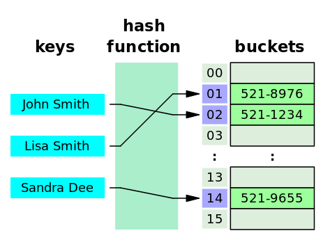

- [해시 테이블](#해시-테이블)
  - [1 개요](#1-개요)
  - [2 `해시`](#2-해시)
    - [2.1 `해시 함수`](#21-해시-함수)
      - [2.1.1 설명](#211-설명)
      - [2.1.2 좋은 해시 함수들의 특징](#212-좋은-해시-함수들의-특징)
      - [2.1.3 사용례](#213-사용례)
      - [2.1.4 나눗셈 방식(Modulo-Division Method)](#214-나눗셈-방식modulo-division-method)
        - [2.1.4.1 h(x)](#2141-hx)
        - [2.1.4.2 x](#2142-x)
        - [2.1.4.3 m](#2143-m)
    - [2.2 `해싱(Hashing)`](#22-해싱hashing)
      - [2.2.1 설명](#221-설명)
      - [2.2.2 사용례](#222-사용례)
  - [3 충돌](#3-충돌)
    - [3.1 생일 문제](#31-생일-문제)
      - [3.1.1 설명](#311-설명)
      - [3.1.2 실험 파이썬 코드](#312-실험-파이썬-코드)
    - [3.2 비둘기집 원리(또는 서랍 원리)](#32-비둘기집-원리또는-서랍-원리)
      - [3.2.1 설명](#321-설명)
    - [3.3 로드 팩터](#33-로드-팩터)
      - [3.3.1 설명](#331-설명)
    - [3.4 처리 방식](#34-처리-방식)
      - [3.4.1 개별 체이닝](#341-개별-체이닝)
        - [3.4.1.1 설명](#3411-설명)
        - [3.4.1.2 예제](#3412-예제)
      - [3.4.2 오픈 어드레싱](#342-오픈-어드레싱)
        - [3.4.2.1 설명](#3421-설명)
        - [3.4.2.2 예제](#3422-예제)
  - [4 언어별 해시 테이블 구현 방식](#4-언어별-해시-테이블-구현-방식)

# 해시 테이블

## 1 개요



- 해시 테이블 또는 해시 맵
- 키를 값에 매핑할 수 있는 구조인, `연관 배열(associative array)` 추상 자료형을 구현하는 자료 구조
- 대부분의 연산이 분할 상환 분석에 따른 시간 복잡도가 O(1)

## 2 `해시`

### 2.1 `해시 함수`

#### 2.1.1 설명

- *임의 크기 데이터를 고정 크기 값으로 매핑*하는 데 사용할 수 있는 함수

```
ABC     -해시 함수-> A1
1324BC  -해시 함수-> CB
AF32B   -해시 함수-> D5
```

- 최상의 분포를 제공하는 방법은 데이터에 따라 제각각

#### 2.1.2 좋은 해시 함수들의 특징

- 해시 함수 값 충돌의 최소화
  - 고정 크기 값으로 변환하면서 같은 값이 나올 수 있기 때문
- 쉽고 빠른 연산
- 해시 테이블 전체에 해시 값이 균일하게 분포
- 사용할 키의 모든 정보를 이용하여 해싱
  - 최대한 겹치지 않도록
- 해시 테이블 사용 효율이 높을 것

#### 2.1.3 사용례

- 개념이 겹치거나 혼용되긴 하지만, 용도와 요구 사항에 따라 각각 다르게 설계되고 최적화된다
  - 체크섬(Checksum)
  - 손실 압축
  - 무작위화 함수(Randomization Function)
  - 암호

#### 2.1.4 나눗셈 방식(Modulo-Division Method)

- h(x) = x % m

##### 2.1.4.1 h(x)

- 해시 함수의 결과

##### 2.1.4.2 x

- 어떤 간단한 규칙 통해 만들어낸 충분히 랜덤한 상태의 키의 값
- 조슈아 블로크는 자바 설계 시 값 x를 다항식의 결과로 정의


- 여기서 x는 31로 하는 거듭제곱 P(31)의 연산으로 정의
- 여러 해시 함수의 성능을 조사했고, **The C Programming Language**에서 P(31)을 찾아냈다. 이 값은 97년 당시 [RISC 머신](https://en.wikipedia.org/wiki/Reduced_instruction_set_computer)에서 가장 저렴한 계산 비용이 들었다고 한다

```c
unsigned hash(char *s){
    unsigned hashval;

    for (hashval = 0; *s != '\0'; s++)
        hashval = *s + 31 * hashval;

    return hashval % HASHSIZE;
}
```

- JDK에 포함된 해시 코드 중 일부

```java
hashCode = 31 * hashCode + (e == null ? 0 : e.hashCode());
```

##### 2.1.4.3 m

- 해시 테이블의 크기

### 2.2 `해싱(Hashing)`

#### 2.2.1 설명

- 해시 테이블을 인덱싱하기 위해 **해시 함수를 사용하는 것**
- 정보를 가능한 한 빠르게 저장하고 검색하기 위해 사용하는 중요한 기법 중 하나

#### 2.2.2 사용례

- 최적의 검색이 필요한 분야
- 심볼 테이블 등의 자료구조 구현

## 3 충돌


- `John Smith`와 `Sandra Dee`의 해시 결과(152)가 충돌

### 3.1 [생일 문제](https://ko.wikipedia.org/wiki/%EC%83%9D%EC%9D%BC_%EB%AC%B8%EC%A0%9C)

#### 3.1.1 설명


> 여러 사람이 모였을 때 생일이 같은 2명이 존재할 확률은, 23명만 모여도 50%를 넘고, 57명 모이면 99%를 넘는다

#### 3.1.2 실험 파이썬 코드

```python
import random

TRIALS = 100000
same_birthday = 0.0

for _ in range(TRIALS):
    birthdays = []
    for i in range(23):
        birthday = random.randint(1, 365)
        if birthday in birthdays:
            same_birthday += 1
            break
        birthdays.append(birthday)

print(f'{same_birthday / TRIALS * 100}%')  # 50.88399999999999%
```

### 3.2 비둘기집 원리(또는 서랍 원리)

#### 3.2.1 설명

> n개 아이템을 m개 컨테이너에 넣을 때, n > m이라면 적어도 하나의 컨테이너에는 반드시 2개 이상의 아이템이 들어있다

- 9개 아이템을 10개 컨테이너에 넣을 때, 반드시 *1번 이상*은 충돌이 발생
  - 좋은 해시 함수라면 1번의 충돌
  - 나쁜 해시 함수라면 9번의 충돌

### 3.3 로드 팩터

#### 3.3.1 설명

> 해시 테이블에 저장된 데이터 개수 n을 버킷의 개수 k로 나눈 것

- 로드 팩터 비율에 따라
  - 해시 함수 재작성
  - 또는 해시 테이블 크기 조정 결정
- 해시 함수가 키들을 잘 분산해주는지를 말하는 효율성 측정에도 사용
- 로드 팩터 증가 = 버킷당 저장되는 데이터 개수 증가 &#8594; 해시 테이블 성능 감소
- [자바에서는 로드 팩터를 0.75로 잡고 있다](https://qr.ae/pNEQdy)
  - 75% 차게 되면, capacity가 두배가 됨을 의미
  - 맵이 75% 차게 되면, 충돌 빈도 증가

### 3.4 처리 방식

#### 3.4.1 개별 체이닝

##### 3.4.1.1 설명

- 해시 테이블의 기본 방식
- 충돌 발생 시 연결 리스트로 연결(link) 하는 방식
- 사실상 무한정 저장 가능
- C++(GCC libstdc++), Java, Go

##### 3.4.1.2 [예제](https://www.geeksforgeeks.org/hashing-set-2-separate-chaining/)


1. 테이블 초기화
2. 50 입력
3. 700과 76 입력
4. 85 입력 시 50과 충돌 발생 -> 체인 추가
5. 92 입력 시 50과 충돌 발생 -> 체인 추가
6. 73과 101 입력, 101에서 충돌 발생 -> 체인 추가

#### 3.4.2 오픈 어드레싱

##### 3.4.2.1 설명

- 충돌 발생 시 테이블 공간 내에서 탐사를 통해 빈 공간을 찾아서 해결
- 전체 슬롯 개수 이상 저장 불가
- 모든 원소가 반드시 자신의 해시값과 일치하는 주소에 저장된다는 보장은 없다
- Python, Ruby

##### 3.4.2.2 [예제](https://www.geeksforgeeks.org/hashing-set-3-open-addressing/)


1. 테이블 초기화
2. 50 입력
3. 700과 76 입력
4. 85 입력 시 50과 충돌 발생 -> 다음 빈 슬롯에 입력
5. 92 입력 시 50과 충돌 발생 -> 다음 빈 슬롯에 입력
6. 73과 101 입력

## 4 언어별 해시 테이블 구현 방식
