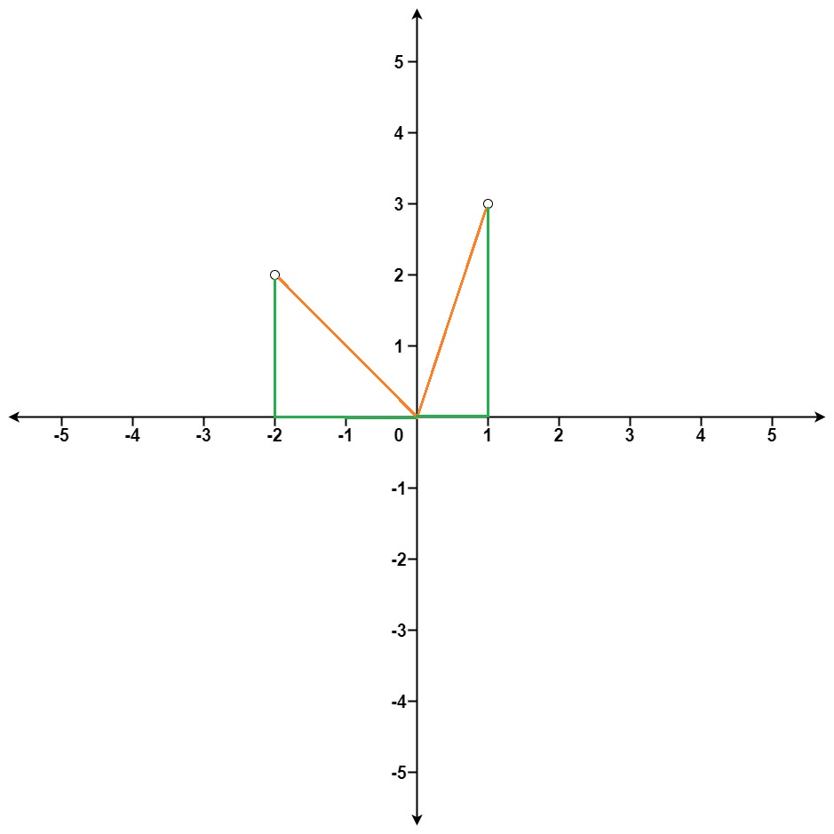

- [973 K Closest Points to Origin](#973-k-closest-points-to-origin)
  - [문제](#문제)
  - [조건](#조건)
  - [예제](#예제)
  - [해결](#해결)
    - [1st](#1st)
      - [1 생각](#1-생각)
      - [1 코드](#1-코드)
    - [2 리트코드 다른 풀이](#2-리트코드-다른-풀이)
      - [2 코드](#2-코드)

# [973 K Closest Points to Origin](https://leetcode.com/problems/k-closest-points-to-origin/)

## 문제

> Given an array of `points` where `points[i] = [xi, yi]` represents a point on the **X-Y** plane  
> and an integer `k`, return the `k` closest points to the origin `(0, 0)`.  
> The distance between two points on the **X-Y** plane is the Euclidean distance  
> (i.e., √(x1 - x2)^2 + (y1 - y2)^2).  
> You may return the answer in any order. The answer is guaranteed to be unique (except for the order that it is in).

- [유클리디안 거리(Euclidean Distance) 개념과 구현해보기](https://needjarvis.tistory.com/454)

## 조건

- 1 <= k <= points.length <= 10^4
- -10^4 < xi, yi < 10^4

## 예제



```python
Input: points = [[1,3],[-2,2]], k = 1
Output: [[-2,2]]
Explanation:
The distance between (1, 3) and the origin is sqrt(10).
The distance between (-2, 2) and the origin is sqrt(8).
Since sqrt(8) < sqrt(10), (-2, 2) is closer to the origin.
We only want the closest k = 1 points from the origin, so the answer is just [[-2,2]].

Input: points = [[3,3],[5,-1],[-2,4]], k = 2
Output: [[3,3],[-2,4]]
Explanation: The answer [[-2,4],[3,3]] would also be accepted.
```

## 해결

### 1st

#### 1 생각

- 거리를 기준으로 정렬한다
- 거리가 키이고, 좌표가 값이 되어야 한다
- 거리를 기준으로 정렬하기 위해 최소 heap으로 구현된 heapq 사용

#### 1 코드

```py
def kClosest(self, points: List[List[int]], k: int) -> List[List[int]]:
    # 원점에서 K 번 가까운 점 목록을 순서대로 출력
    # 거리 순으로 정렬

    heap = []
    for x, y in points:
        # dist = math.sqrt((0 - x) ** 2 + (0 - y) ** 2)
        # 거리 계산을 모두 정확하게 할 필요는 없다
        dist = x ** 2 + y ** 2
        heapq.heappush(heap, (dist, x, y))
    
    result = []
    for _ in range(k):
        dist, x, y = heapq.heappop(heap)
        result.append([x, y])

    return result
```

### 2 리트코드 다른 풀이

#### 2 코드

```py
def kClosest2(self, points: List[List[int]], K: int) -> List[List[int]]:
    return sorted(points, key=lambda x: x[0]*x[0]+x[1]*x[1])[:K]


def kClosest3(self, points: List[List[int]], K: int) -> List[List[int]]:
    heap = []
    
    for (x, y) in points:
        dist = -(x*x + y*y)
        if len(heap) == K:
            heapq.heappushpop(heap, (dist, x, y))
        else:
            heapq.heappush(heap, (dist, x, y))
    
    return [(x,y) for (dist,x, y) in heap]
```
