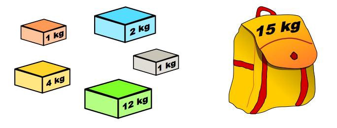

- [0-1 배낭 문제](#0-1-배낭-문제)
  - [문제](#문제)
  - [해결](#해결)
    - [1st](#1st)
      - [1 책 정리](#1-책-정리)
      - [1 코드](#1-코드)

# [0-1 배낭 문제](https://en.wikipedia.org/wiki/Knapsack_problem)

## 문제



> 배낭의 가치가 최대가 되도록 담을 짐을 고르는 방법을 찾는 문제

## 해결

### 1st

#### 1 책 정리

- 모든 경우의 수를 계산해야 한다
- `pack`:
  - 6 x 16 행렬 형태의 중간 결과 테이블(타뷸레이션)
  - `짐의 최대 개수` + 1 = 6
  - `배낭의 최대 용량` + 1 = 16
  - 각 셀에는 그 위치까지의 짐의 개수와 배낭의 용량에 따른 최댓값이 담기게 된다

#### 1 코드

```py

# https://stackoverflow.com/a/35814621
def TableFormat(A):
    MaxLength=0
    for i in range(len(A)):
        for x in A[i]:
            MaxLength =len(str(x)) if MaxLength<len(str(x)) else MaxLength
    for i in range(len(A)):
        for x in range(0,len(A[i])):
            Length=MaxLength-len(str(A[i][x]))
            print((" "*Length)+str(A[i][x]),end="|")
        print()
        
def zero_one_knapsack(cargo):
    capacity = 15
    pack = []

    for i in range(len(cargo) + 1): # 짐의 최대 개수 + 1
        # pack[짐 개수 인덱스][배낭 용량] = 최대값
        pack.append([])
        for c in range(capacity + 1): # 배낭의 최대 용량 + 1
            if i == 0 or c == 0:
                print("[if  ] i:{}, c:{}".format(i, c))
                pack[i].append(0)
            elif cargo[i - 1][1] <= c: # 현재 짐의 무게를 넣을 수 있는지?
                print("[elif] i:{}, c:{}, cargo[i-1={}][0]={} + pack[i-1={}][(c - cargo[i-1={}][1]={})={}]={} vs pack[i-1={}][c={}]={}".format(i, c, i-1, cargo[i-1][0], i-1, i-1, cargo[i - 1][1], c - cargo[i - 1][1], pack[i-1][c - cargo[i-1][1]], i-1, c, pack[i - 1][c]))
                pack[i].append(
                    # 현재 i번째 짐 개수에 대해, 이전 i-1번째까지의 최대값과 더하여 더 큰 값을 저장한다
                    max(
                        cargo[i - 1][0] + pack[i - 1][c - cargo[i - 1][1]],
                        pack[i - 1][c]
                    )
                )
            else:
                print("[else] i:{}, cargo[i - 1][1]: {}, c:{}, pack[i - 1][{}]:{}".format(i, cargo[i - 1][1], c, c, pack[i - 1][c]))
                pack[i].append(pack[i - 1][c])
        print()    
    TableFormat(pack)

    return pack[-1][-1]

# ($, kg)
cargo = [
    (4, 12),
    (2, 1),
    (10, 4),
    (1, 1),
    (2, 2),
]
print(zero_one_knapsack(cargo))
```

```py
# i: 짐(cargo)의 인덱스
# c: 배낭 용량의 케이스
i\c 0  1  2  3  4  5  6  7  8  9 10 11 12 13 14 15 
0   0| 0| 0| 0| 0| 0| 0| 0| 0| 0| 0| 0| 0| 0| 0| 0|
1   0| 0| 0| 0| 0| 0| 0| 0| 0| 0| 0| 0| 4| 4| 4| 4|
2   0| 2| 2| 2| 2| 2| 2| 2| 2| 2| 2| 2| 4| 6| 6| 6|
3   0| 2| 2| 2|10|12|12|12|12|12|12|12|12|12|12|12|
4   0| 2| 3| 3|10|12|13|13|13|13|13|13|13|13|13|13|
5   0| 2| 3| 4|10|12|13|14|15|15|15|15|15|15|15|15|
> 배낭 용량이 4인 경우, ($10, 4kg)이 등장한 i=3부터 최대값은 10이 된다
> 배낭 용량이 5인 경우, ($10, 4kg)이 등장한 i=3부터 ($10, 4) + ($2, 1)로 12가 된다

# 0| 0| 0| 0| 0| 0| 0| 0| 0| 0| 0| 0| 0| 0| 0| 0|
[if  ] i:0, c:0
[if  ] i:0, c:1
[if  ] i:0, c:2
[if  ] i:0, c:3
[if  ] i:0, c:4
[if  ] i:0, c:5
[if  ] i:0, c:6
[if  ] i:0, c:7
[if  ] i:0, c:8
[if  ] i:0, c:9
[if  ] i:0, c:10
[if  ] i:0, c:11
[if  ] i:0, c:12
[if  ] i:0, c:13
[if  ] i:0, c:14
[if  ] i:0, c:15

# 0| 0| 0| 0| 0| 0| 0| 0| 0| 0| 0| 0| 4| 4| 4| 4|
[if  ] i:1, c:0
[else] i:1, cargo[i - 1][1]: 12, c:1, pack[i - 1][1]:0
[else] i:1, cargo[i - 1][1]: 12, c:2, pack[i - 1][2]:0
[else] i:1, cargo[i - 1][1]: 12, c:3, pack[i - 1][3]:0
[else] i:1, cargo[i - 1][1]: 12, c:4, pack[i - 1][4]:0
[else] i:1, cargo[i - 1][1]: 12, c:5, pack[i - 1][5]:0
[else] i:1, cargo[i - 1][1]: 12, c:6, pack[i - 1][6]:0
[else] i:1, cargo[i - 1][1]: 12, c:7, pack[i - 1][7]:0
[else] i:1, cargo[i - 1][1]: 12, c:8, pack[i - 1][8]:0
[else] i:1, cargo[i - 1][1]: 12, c:9, pack[i - 1][9]:0
[else] i:1, cargo[i - 1][1]: 12, c:10, pack[i - 1][10]:0
[else] i:1, cargo[i - 1][1]: 12, c:11, pack[i - 1][11]:0
[elif] i:1, c:12, cargo[i-1=0][0]=4 + pack[i-1=0][(c - cargo[i-1=0][1]=12)=0]=0 vs pack[i-1=0][c=12]=0
[elif] i:1, c:13, cargo[i-1=0][0]=4 + pack[i-1=0][(c - cargo[i-1=0][1]=12)=1]=0 vs pack[i-1=0][c=13]=0
[elif] i:1, c:14, cargo[i-1=0][0]=4 + pack[i-1=0][(c - cargo[i-1=0][1]=12)=2]=0 vs pack[i-1=0][c=14]=0
[elif] i:1, c:15, cargo[i-1=0][0]=4 + pack[i-1=0][(c - cargo[i-1=0][1]=12)=3]=0 vs pack[i-1=0][c=15]=0

# 0| 2| 2| 2| 2| 2| 2| 2| 2| 2| 2| 2| 4| 6| 6| 6|
[if  ] i:2, c:0
[elif] i:2, c:1, cargo[i-1=1][0]=2 + pack[i-1=1][(c - cargo[i-1=1][1]=1)=0]=0 vs pack[i-1=1][c=1]=0
[elif] i:2, c:2, cargo[i-1=1][0]=2 + pack[i-1=1][(c - cargo[i-1=1][1]=1)=1]=0 vs pack[i-1=1][c=2]=0
[elif] i:2, c:3, cargo[i-1=1][0]=2 + pack[i-1=1][(c - cargo[i-1=1][1]=1)=2]=0 vs pack[i-1=1][c=3]=0
[elif] i:2, c:4, cargo[i-1=1][0]=2 + pack[i-1=1][(c - cargo[i-1=1][1]=1)=3]=0 vs pack[i-1=1][c=4]=0
[elif] i:2, c:5, cargo[i-1=1][0]=2 + pack[i-1=1][(c - cargo[i-1=1][1]=1)=4]=0 vs pack[i-1=1][c=5]=0
[elif] i:2, c:6, cargo[i-1=1][0]=2 + pack[i-1=1][(c - cargo[i-1=1][1]=1)=5]=0 vs pack[i-1=1][c=6]=0
[elif] i:2, c:7, cargo[i-1=1][0]=2 + pack[i-1=1][(c - cargo[i-1=1][1]=1)=6]=0 vs pack[i-1=1][c=7]=0
[elif] i:2, c:8, cargo[i-1=1][0]=2 + pack[i-1=1][(c - cargo[i-1=1][1]=1)=7]=0 vs pack[i-1=1][c=8]=0
[elif] i:2, c:9, cargo[i-1=1][0]=2 + pack[i-1=1][(c - cargo[i-1=1][1]=1)=8]=0 vs pack[i-1=1][c=9]=0
[elif] i:2, c:10, cargo[i-1=1][0]=2 + pack[i-1=1][(c - cargo[i-1=1][1]=1)=9]=0 vs pack[i-1=1][c=10]=0
[elif] i:2, c:11, cargo[i-1=1][0]=2 + pack[i-1=1][(c - cargo[i-1=1][1]=1)=10]=0 vs pack[i-1=1][c=11]=0
[elif] i:2, c:12, cargo[i-1=1][0]=2 + pack[i-1=1][(c - cargo[i-1=1][1]=1)=11]=0 vs pack[i-1=1][c=12]=4
[elif] i:2, c:13, cargo[i-1=1][0]=2 + pack[i-1=1][(c - cargo[i-1=1][1]=1)=12]=4 vs pack[i-1=1][c=13]=4
[elif] i:2, c:14, cargo[i-1=1][0]=2 + pack[i-1=1][(c - cargo[i-1=1][1]=1)=13]=4 vs pack[i-1=1][c=14]=4
[elif] i:2, c:15, cargo[i-1=1][0]=2 + pack[i-1=1][(c - cargo[i-1=1][1]=1)=14]=4 vs pack[i-1=1][c=15]=4

# 0| 2| 2| 2|10|12|12|12|12|12|12|12|12|12|12|12|
[if  ] i:3, c:0
[else] i:3, cargo[i - 1][1]: 4, c:1, pack[i - 1][1]:2
[else] i:3, cargo[i - 1][1]: 4, c:2, pack[i - 1][2]:2
[else] i:3, cargo[i - 1][1]: 4, c:3, pack[i - 1][3]:2
[elif] i:3, c:4, cargo[i-1=2][0]=10 + pack[i-1=2][(c - cargo[i-1=2][1]=4)=0]=0 vs pack[i-1=2][c=4]=2
[elif] i:3, c:5, cargo[i-1=2][0]=10 + pack[i-1=2][(c - cargo[i-1=2][1]=4)=1]=2 vs pack[i-1=2][c=5]=2
[elif] i:3, c:6, cargo[i-1=2][0]=10 + pack[i-1=2][(c - cargo[i-1=2][1]=4)=2]=2 vs pack[i-1=2][c=6]=2
[elif] i:3, c:7, cargo[i-1=2][0]=10 + pack[i-1=2][(c - cargo[i-1=2][1]=4)=3]=2 vs pack[i-1=2][c=7]=2
[elif] i:3, c:8, cargo[i-1=2][0]=10 + pack[i-1=2][(c - cargo[i-1=2][1]=4)=4]=2 vs pack[i-1=2][c=8]=2
[elif] i:3, c:9, cargo[i-1=2][0]=10 + pack[i-1=2][(c - cargo[i-1=2][1]=4)=5]=2 vs pack[i-1=2][c=9]=2
[elif] i:3, c:10, cargo[i-1=2][0]=10 + pack[i-1=2][(c - cargo[i-1=2][1]=4)=6]=2 vs pack[i-1=2][c=10]=2
[elif] i:3, c:11, cargo[i-1=2][0]=10 + pack[i-1=2][(c - cargo[i-1=2][1]=4)=7]=2 vs pack[i-1=2][c=11]=2
[elif] i:3, c:12, cargo[i-1=2][0]=10 + pack[i-1=2][(c - cargo[i-1=2][1]=4)=8]=2 vs pack[i-1=2][c=12]=4
[elif] i:3, c:13, cargo[i-1=2][0]=10 + pack[i-1=2][(c - cargo[i-1=2][1]=4)=9]=2 vs pack[i-1=2][c=13]=6
[elif] i:3, c:14, cargo[i-1=2][0]=10 + pack[i-1=2][(c - cargo[i-1=2][1]=4)=10]=2 vs pack[i-1=2][c=14]=6
[elif] i:3, c:15, cargo[i-1=2][0]=10 + pack[i-1=2][(c - cargo[i-1=2][1]=4)=11]=2 vs pack[i-1=2][c=15]=6

# 0| 2| 3| 3|10|12|13|13|13|13|13|13|13|13|13|13|
[if  ] i:4, c:0
[elif] i:4, c:1, cargo[i-1=3][0]=1 + pack[i-1=3][(c - cargo[i-1=3][1]=1)=0]=0 vs pack[i-1=3][c=1]=2
[elif] i:4, c:2, cargo[i-1=3][0]=1 + pack[i-1=3][(c - cargo[i-1=3][1]=1)=1]=2 vs pack[i-1=3][c=2]=2
[elif] i:4, c:3, cargo[i-1=3][0]=1 + pack[i-1=3][(c - cargo[i-1=3][1]=1)=2]=2 vs pack[i-1=3][c=3]=2
[elif] i:4, c:4, cargo[i-1=3][0]=1 + pack[i-1=3][(c - cargo[i-1=3][1]=1)=3]=2 vs pack[i-1=3][c=4]=10
[elif] i:4, c:5, cargo[i-1=3][0]=1 + pack[i-1=3][(c - cargo[i-1=3][1]=1)=4]=10 vs pack[i-1=3][c=5]=12
[elif] i:4, c:6, cargo[i-1=3][0]=1 + pack[i-1=3][(c - cargo[i-1=3][1]=1)=5]=12 vs pack[i-1=3][c=6]=12
[elif] i:4, c:7, cargo[i-1=3][0]=1 + pack[i-1=3][(c - cargo[i-1=3][1]=1)=6]=12 vs pack[i-1=3][c=7]=12
[elif] i:4, c:8, cargo[i-1=3][0]=1 + pack[i-1=3][(c - cargo[i-1=3][1]=1)=7]=12 vs pack[i-1=3][c=8]=12
[elif] i:4, c:9, cargo[i-1=3][0]=1 + pack[i-1=3][(c - cargo[i-1=3][1]=1)=8]=12 vs pack[i-1=3][c=9]=12
[elif] i:4, c:10, cargo[i-1=3][0]=1 + pack[i-1=3][(c - cargo[i-1=3][1]=1)=9]=12 vs pack[i-1=3][c=10]=12
[elif] i:4, c:11, cargo[i-1=3][0]=1 + pack[i-1=3][(c - cargo[i-1=3][1]=1)=10]=12 vs pack[i-1=3][c=11]=12
[elif] i:4, c:12, cargo[i-1=3][0]=1 + pack[i-1=3][(c - cargo[i-1=3][1]=1)=11]=12 vs pack[i-1=3][c=12]=12
[elif] i:4, c:13, cargo[i-1=3][0]=1 + pack[i-1=3][(c - cargo[i-1=3][1]=1)=12]=12 vs pack[i-1=3][c=13]=12
[elif] i:4, c:14, cargo[i-1=3][0]=1 + pack[i-1=3][(c - cargo[i-1=3][1]=1)=13]=12 vs pack[i-1=3][c=14]=12
[elif] i:4, c:15, cargo[i-1=3][0]=1 + pack[i-1=3][(c - cargo[i-1=3][1]=1)=14]=12 vs pack[i-1=3][c=15]=12

# 0| 2| 3| 4|10|12|13|14|15|15|15|15|15|15|15|15|
[if  ] i:5, c:0
[else] i:5, cargo[i - 1][1]: 2, c:1, pack[i - 1][1]:2
[elif] i:5, c:2, cargo[i-1=4][0]=2 + pack[i-1=4][(c - cargo[i-1=4][1]=2)=0]=0 vs pack[i-1=4][c=2]=3
[elif] i:5, c:3, cargo[i-1=4][0]=2 + pack[i-1=4][(c - cargo[i-1=4][1]=2)=1]=2 vs pack[i-1=4][c=3]=3
[elif] i:5, c:4, cargo[i-1=4][0]=2 + pack[i-1=4][(c - cargo[i-1=4][1]=2)=2]=3 vs pack[i-1=4][c=4]=10
[elif] i:5, c:5, cargo[i-1=4][0]=2 + pack[i-1=4][(c - cargo[i-1=4][1]=2)=3]=3 vs pack[i-1=4][c=5]=12
[elif] i:5, c:6, cargo[i-1=4][0]=2 + pack[i-1=4][(c - cargo[i-1=4][1]=2)=4]=10 vs pack[i-1=4][c=6]=13
[elif] i:5, c:7, cargo[i-1=4][0]=2 + pack[i-1=4][(c - cargo[i-1=4][1]=2)=5]=12 vs pack[i-1=4][c=7]=13
[elif] i:5, c:8, cargo[i-1=4][0]=2 + pack[i-1=4][(c - cargo[i-1=4][1]=2)=6]=13 vs pack[i-1=4][c=8]=13
[elif] i:5, c:9, cargo[i-1=4][0]=2 + pack[i-1=4][(c - cargo[i-1=4][1]=2)=7]=13 vs pack[i-1=4][c=9]=13
[elif] i:5, c:10, cargo[i-1=4][0]=2 + pack[i-1=4][(c - cargo[i-1=4][1]=2)=8]=13 vs pack[i-1=4][c=10]=13
[elif] i:5, c:11, cargo[i-1=4][0]=2 + pack[i-1=4][(c - cargo[i-1=4][1]=2)=9]=13 vs pack[i-1=4][c=11]=13
[elif] i:5, c:12, cargo[i-1=4][0]=2 + pack[i-1=4][(c - cargo[i-1=4][1]=2)=10]=13 vs pack[i-1=4][c=12]=13
[elif] i:5, c:13, cargo[i-1=4][0]=2 + pack[i-1=4][(c - cargo[i-1=4][1]=2)=11]=13 vs pack[i-1=4][c=13]=13
[elif] i:5, c:14, cargo[i-1=4][0]=2 + pack[i-1=4][(c - cargo[i-1=4][1]=2)=12]=13 vs pack[i-1=4][c=14]=13
[elif] i:5, c:15, cargo[i-1=4][0]=2 + pack[i-1=4][(c - cargo[i-1=4][1]=2)=13]=13 vs pack[i-1=4][c=15]=13
```
