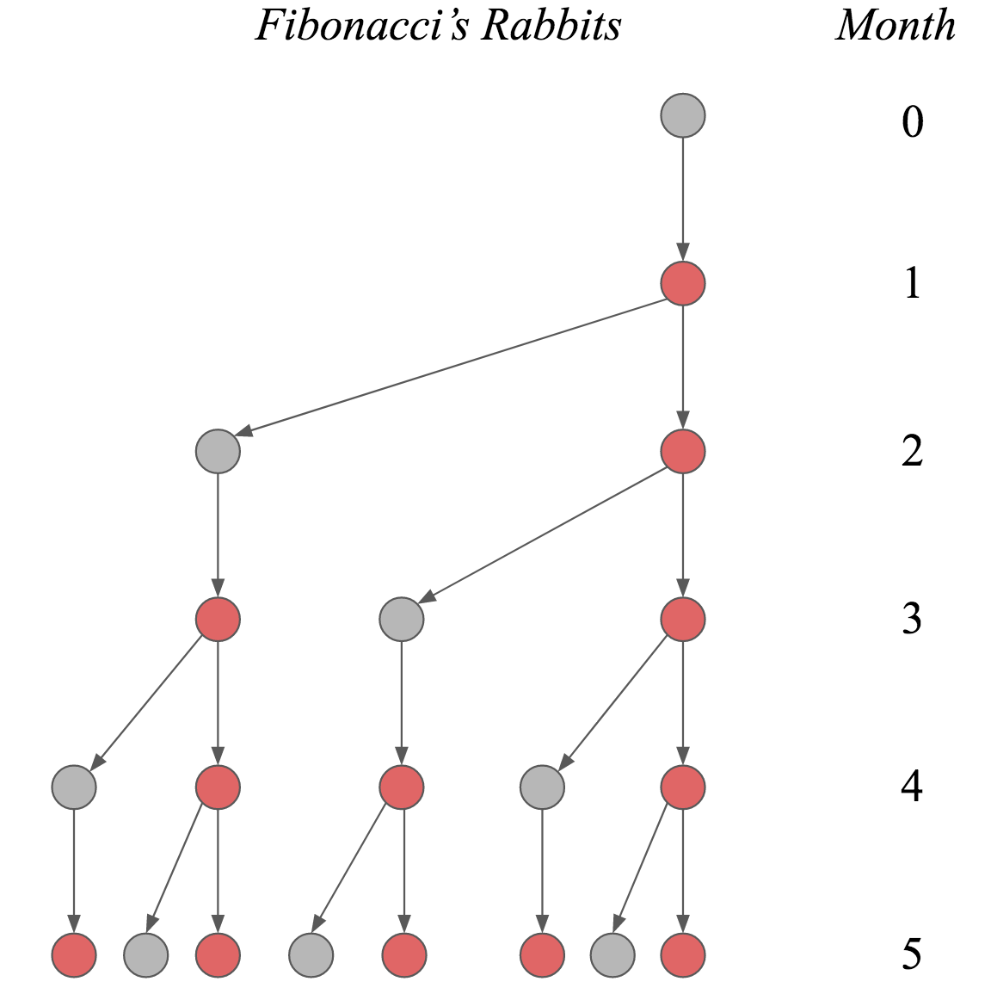

- [509 Fibonacci Number](#509-fibonacci-number)
  - [문제](#문제)
    - [피보나치 수열](#피보나치-수열)
  - [조건](#조건)
  - [예제](#예제)
  - [해결](#해결)
    - [1st](#1st)
      - [1 생각](#1-생각)
      - [1 코드](#1-코드)
      - [1 결과](#1-결과)
        - [fib_bottom_up](#fib_bottom_up)
        - [fib_top_down](#fib_top_down)
    - [2nd 다른 풀이](#2nd-다른-풀이)
      - [2 코드](#2-코드)
      - [2 속도 비교](#2-속도-비교)

# [509 Fibonacci Number](https://leetcode.com/problems/fibonacci-number/)

## 문제

> The **Fibonacci numbers**, commonly denoted `F(n)` form a sequence, called the **Fibonacci sequence**, such that each number is the sum of the two preceding ones, starting from `0` and `1`. That is,  
> `F(0) = 0, F(1) = 1`  
> `F(n) = F(n - 1) + F(n - 2), for n > 1.`  
> Given `n`, calculate `F(n)`.  

- 각 수가 앞선 두 수의 합으로 이루어짐
- `0`과 `1`부터 시작

### 피보나치 수열

> 문제: 토끼가 한 쌍 있다면 몇 달이 지난 후에 토끼는 몇 쌍으로 늘어날까?  
> 조건:  
>
> - 처음 토끼 한 쌍이 있으면 모든 쌍은 항상 한 배에 암수 한 쌍을 낳는다.  
> - 토끼 암컷은 태어난 지 한 달이면 새끼를 낳을 수 있으며, 계속하여 한 달에 함수 한 쌍씩 낳는다.  
> - 토끼는 죽지 않는다

[](https://science.nu/the-fibonacci-sequence-and-linear-algebra/)

## 조건

- 0 <= n <= 30

## 예제

```py
Input: n = 2
Output: 1
Explanation: F(2) = F(1) + F(0) = 1 + 0 = 1.

Input: n = 3
Output: 2
Explanation: F(3) = F(2) + F(1) = 1 + 1 = 2.

Input: n = 4
Output: 3
Explanation: F(4) = F(3) + F(2) = 2 + 1 = 3.
```

## 해결

### 1st

#### 1 생각

- 동적 계획법 상향식/하향식 모두 풀이를 해보자

#### 1 코드

```py
class Solution:
    dp = collections.defaultdict(int)

    def fib(self, n: int) -> int:
        return self.fib_bottom_up(n)

    # Tabulation
    def fib_bottom_up(self, n):
        self.dp[0] = 0
        self.dp[1] = 1

        for i in range(2, n + 1):
            self.dp[i] = self.dp[i - 1] + self.dp[i -2]

        return self.dp[n]

    # Memoization
    def fib_top_down(self, n):
        if n <= 1:
            return n
        
        if n in self.dp:
            return self.dp[n]
        
        self.dp[n] = self.fib_top_down(n - 1) + self.fib_top_down(n - 2)

        return self.dp[n]
```

#### 1 결과

##### fib_bottom_up

> Runtime: 24 ms, faster than 92.41% of Python3 online submissions for Fibonacci Number.  
> Memory Usage: 14.2 MB, less than 69.17% of Python3 online submissions for Fibonacci Number.

##### fib_top_down

> Runtime: 44 ms, faster than 27.70% of Python3 online submissions for Fibonacci Number.  
> Memory Usage: 14 MB, less than 97.42% of Python3 online submissions for Fibonacci Number.

### 2nd 다른 풀이

#### 2 코드

```py
def fib_two_var(self, n):
    # x: 현재 피보나치 수
    # y: 다음 피보나치 수
    x, y = 0, 1
    for i in range(0, n):
        x, y = y, x + y
    return x

def fib_matrix(self, n):
    import numpy as np
    M = np.matrix([[0, 1], [1, 1]])
    vec = np.array([[0], [1]])

    return np.matmul(M ** n, vec)[0]
```

- [행렬 관련 참고1](https://m.blog.naver.com/yjh0853/221473053842)
- [행렬 관련 참고2](https://medium.com/future-vision/fibonacci-sequence-algorithm-5eebae4e85be)

#### 2 속도 비교

```py
print('fib_bottom_up:{}'.format(timeit.timeit(lambda: s.fib_bottom_up(30), number=10000)))
print('fib_top_down:{}'.format(timeit.timeit(lambda: s.fib_top_down(30), number=10000)))
print('fib_two_var:{}'.format(timeit.timeit(lambda: s.fib_two_var(30), number=10000)))
print('fib_matrix:{}'.format(timeit.timeit(lambda: s.fib_matrix(30), number=10000)))

'''
fib_bottom_up:0.060466000000000006
fib_top_down:0.0042472999999999955
fib_two_var:0.01861639999999999
fib_matrix:0.6557445000000001
'''
 
""" import cProfile
import pstats
pr = cProfile.Profile()
pr.enable()
for i in range(10000):
    # s.fib_bottom_up(30)
    # s.fib_top_down(30)
    s.fib_two_var(30)
    # s.fib_matrix(30)
pr.disable()
pstats.Stats(pr).print_stats() """
```
