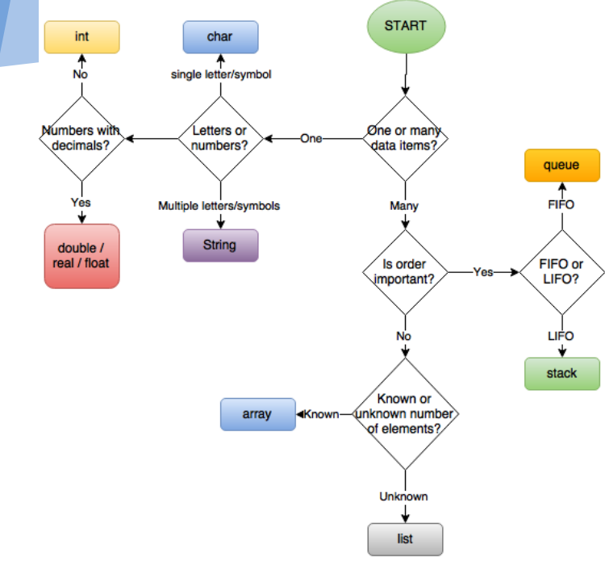

# 7장 배열

- [7장 배열](#7장-배열)
  - [자료 구조](#자료-구조)
    - [연속 방식](#연속-방식)
    - [연결 방식](#연결-방식)
  - [ADT(Abstract Data Type)](#adtabstract-data-type)
  - [배열](#배열)
  - [동적 배열](#동적-배열)

## 자료 구조

### 연속 방식

[^1]
[^1]: <https://beginnersbook.com/2014/01/c-pointer-to-array-example/>

- 메모리 공간 기반
- 자료형에 따라 정해진 크기에 따라 연속된 메모리 공간을 할당
- e.g 배열

### 연결 방식

[^2]
[^2]: <https://beginnersbook.com/2013/12/linkedlist-in-java-with-example/>

- 포인터 기반
- e.g 연결 리스트

## ADT(Abstract Data Type)

[^3]
[^3]: <https://computersciencewiki.org/index.php/Abstract_data_structures>

- 스택, 큐 등 자료에 대한 일련의 연산, 각 연산에 대한 연산 복잡도가 정의된 가상의 자료 저장 공간
- 대부분 배열 또는 연결 리스트 기반으로 구현

## 배열

- 크기를 지정하고 해당 크기만큼의 연속된 메모리 공간을 할당받는 작업을 수행하는 자료형
- 어느 위치에나 O(1) 조회 가능
- 메모리 주소를 계산하여 해당 메모리 주소에 있는 값 조회 가능

## 동적 배열

- 원래 배열 정의와는 다르게, 미리 크기를 지정하지 않고 자동으로 조정
  - 공간을 다 사용한 경우, 보통 기존 메모리의 두 배 정도의 새로운 메모리 공간 할당
  - 기존 내용들을 복사
  - 기존 배열의 메모리 해제
- e.g Java의 ArrayList, C++의 std::vector, Python의 List
- 대부분의 동적 프로그래밍 언어들은 정적 배열 자체가 없으며, Python도 동적 배열인 리스트만 제공
